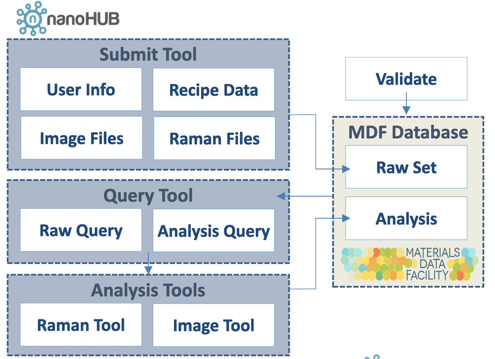

# nanoMFG Software Planning Document
<!-- Replace text below with long title of project:short-name -->
## Graphene Raman Analysis Tool: GSARaman
### Target Release: 1.2.0 : July 31, 2019

## Development Team
<!-- Complete table for all team members
 roles: PI, developer, validation
 status: active, inactive
-->
Name | Role | github user | nanohub user | email | status
---|---|---|---|---|---
Elif Ertekin | PI | elifleaf | Elif Ertekin | ertekin@illinois.edu | active
Sameh Tawfick | PI | tawfick | --- | tawfick@illinois.edu | active
Matthew Robertson | developer | mgrober2 | Matthew Glen Robertson | mgrober2@illinois.edu | inactive
Kristina Miller | developer | kmmille | Kristina M Miller | kmmille2@illinois.edu | inactive
Darren Adams | developer | dadamsncsa | Darren K Adams | dadams@illinois.edu | active

**nanoMFG Github Team(s):** @GSA-dev
**nanoHUB Group(s):** Gr-ResQ

## 1. Introduction
<!-- A  concise description of the current iteration of work. -->
GSARaman allows users to extract relevant data from raman spectographs using an automated Lorentzian fitting. The current iteration of the tool will include improvements in tool performance. This iteration of GSARaman will be released as a standalone tool as well as a feature of the Gr-ResQ (Graphene Recipes for the Synthesis of High Quality Materials) database suite.

### 1.1 Purpose and Vision Statement
<!--Why are we building this tool? What is the key benefit? How does it relate to existing tools and existing software? How does it fit into the overall objectives for the nanoMFG node? Who will use it?-->
Raman spectographs are one of the primary resources for graphene synthesis analysis. GSARaman will permit users to extract information from these Raman spectrographs like defect density and graphene quality. These features will inform users and augment machine learning on the data by providing it with objective metrics to optimize. GSARaman allows users to analyze single Raman spectra or a full spectral map, each pixel of which is resolved to single Raman spectra. This tool will be released as a standalone research tool and as a feature of the "gresq" graphene synthesis database dashboard.

### 1.2 References
<!--List any documents or background material that are relevant.  Links are useful. For instance, a link to a wiki or readme page in the project repository, or link to a uploaded file (doc, pdf, ppt, etc.).-->
[GSARaman README Page](https://github.com/nanoMFG/GSA-Raman/blob/master/README.md "GSARaman README Page")

## 2 Overview and Major Planned Features
<!--Provide and overview characterising this proposed release.  Describe how users will interact with each proposed feature.-->
Version 1.2.0 will include features related to performance and compatibility with the Gr-ResQ dashboard. In addition, a user manual with intuitive screenshots will be released for user instruction.

### 2.1 Product Background and Strategic Fit
<!--Provide context for the proposed product.  Is this a completely new projects, or next version of an existing project? This can include a description of any contextual research, or the status of any existing prototype application.  If this SPD describes a component, describe its relationship to larger system. Can include diagrams.-->

This release of GSARaman represents the next version of an already published nanoHUB tool. This version of GSARaman will also be included as an analysis feature with the Gr-ResQ database tool suite. Flow for the component tools in the Gr-ResQ tool suite is shown above. The Raman analysis tool is included as an analysis feature to study Raman spectrographs associated with various graphene recipes.

### 2.2 Scope and Limitations for Current Release
<!--List the all planned goals/features for this release.  These should be links to issues.  Add a new subsection for each release.  Equally important, document feature you explicity are not doing at this time-->

#### Release Notes v1.2.0
##### Planned Features

Feature | description
--- | ---
[Reduced Data Footprint](https://github.com/nanoMFG/GSA-Raman/issues/46 "Reduced Data Footprint") | Previous tool iteration showed data footprints in excess of 100MB after processing; current release reduces amount of stored data
[Allow Uploading Multiple Map Files](https://github.com/nanoMFG/GSA-Raman/issues/49 "Allow Uploading Multiple Map Files") | Previous tool iteration freezes when multiple map files are uploaded; current release fixes bug

##### Not Done

### 2.3 Scope and Limitations for Subsequent Releases
<!--Short summary of  future envisioned roadmap for subsequent efforts.-->

### 2.3 Operating Environment
<!--Describe the target environment.  Identify components or application that are needed.  Describe technical infrastructure need to support the application.-->
Program uses PyQt environment

### 2.4 Design and Implementation Constraints
<!--This could include pre-existing code that needs to be incorporated ,a certain programming language or toolkit and software dependencies.  Describe the origin and rationale for each constraint.-->
* matplotlib
* PyQt5
* pyqtgraph
* pandas
* numpy
* scipy
* multiprocessing
* qimage2ndarray
* tempfile
* shutil
* os
* zipfile
* json

## 3 User Interaction and Design

### 3.1 Classes of Users
<!--Identify classes (types) of users that you anticipate will use the product.  Provide any relevant context about each class that may influence how the product is used:
The tasks the class of users will perform
Access and privilege level
Features used
Experience level
Type of interaction
Provide links to any user surveys, questionnaires, interviews, feedback or other relevant information.-->
Type | Access Level | Features Used | Experience Level | Type of interaction
--- | --- | --- | --- | ---
Community User | All | All | Novice | Used for own research
nanoMFG User | All | All | Experienced | Used for generating data for Gr-ResQ database

### 3.2 User Requirements
<!-- Provide a list of issue links to document the main set of user requirements to be satisfied by this release.  Use the user requirement template to draft thense issues.  A well written user requirement should be easy to justify (Rational) and should be testable.  List in order of priority as must have, should have or nice to have for each use case. -->

### 3.3 Proposed User Interface
<!--Could include drawn mockups, screenshots of prototypes, comparison to existing software and other descriptions.-->

## 4. Data And Quality Attributes

### 4.1 Data Dictionary
<!--Summarize inputs and outputs for the application.-->

### 4.2 Usability and Performance
<!--Summarize usability requirements such as easy of adoption for new users (eg example data),  inline documentation, avoiding errors, efficient interaction, etc.  Describe performance expectations  and/or document challenges.  Note you can reference user requirements from above if needed. -->

### 4.3 Testing, Verification and Validation
<!--Describe What data is necessary to verify the basic functionality of the application.  Provide a testing plan that includes a list of issues for each planned activity.  Describe data sets that are needed to test validation.-->

### 4.4 Uncertainty Quantification
<!--Identify and document possible sources of uncertainty. Categorize with standard labels, such as parametric, structural, algorithmic, experimental, interpolation.

Develop a plan for measuring and documenting uncertainty, e.g., using forward propagation or inverse UQ, and showing it in the application, if applicable.-->
